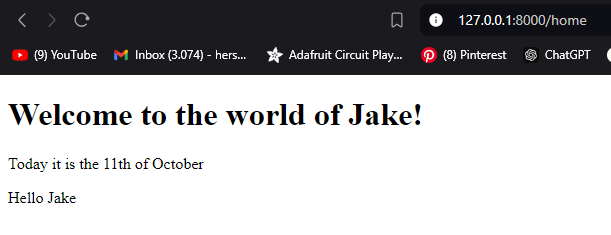
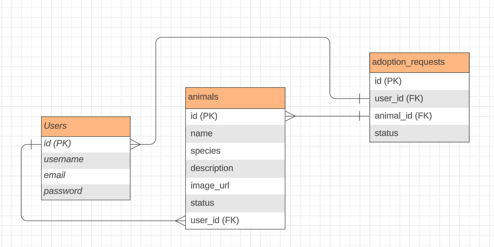

# changelog

Ik heb vandaag **09/10/2024** het programmeren 5 laravel project

[naam van de link](www.google.com)

Ik heb vandaag **11/10/2024**:

- een Homecontroller bestand gemaakt
- een index functie in Homecontroller.php gemaakt
- een route voor Home in web.php gemaakt
- gewerkt met compact() functie en variables
- gewerkt aan de view

Ik heb vandaag **12/10/2024**:

- Route parameters toegevoegd zodat ik meer specifieke URL's kan invoeren (http://127.0.0.1:8000/home/Jake bijvoorbeeld geeft je de pagina om mijn info te zien)
- ProductController.php (Resource) bestand gemaakt.
- index.blade.php en show.blade.php bestand gemaakt
- Route met parameter toegevoegd voor products url in web.php

Ik heb vandaag **13/10/2024**:

- Een idee voor mijn applicatie gekregen
- Een beschrijving geschreven voor mijn applicatie
- User Stories gemaakt

Mijn idee voor mijn applicatie:

**Een huisdieren adoptatie applicatie.**

De applicatie is een plek voor het adopteren van huisdieren waar **normale gebruikers/bezoekers** huisdieren kunnen bekijken en misschien een knop kunnen drukken om te "adopteren". 

**Ingelogde gebruikers** kunnen dieren toevoegen, bewerken en verwijderen. 

**De admin** krijgt een dashboard te zien met..

De applicatie laat een detailpagina voor elk dier zien met informatie zoals tekst en afbeelding en een zoek- en filterfunctie, dit kan dus bijvoorbeeld zijn: Honden, Katten, Knaagdieren, Vogels etc.

**User Stories**
Gebruikers (De mensen die willen/gaan adopteren):
- Als gebruiker wil ik me kunnen registreren en inloggen, zodat ik toegang heb tot functies die alleen voor ingelogde gebruikers zijn.

- Als gebruiker wil ik een lijst kunnen zien van beschikbare huisdieren, zodat ik kan kijken welke dieren er voor adoptie zijn.

- Als gebruiker wil ik meer informatie over een huisdier kunnen bekijken, zodat ik een goed beeld krijg van het huisdier dat ik overweeg te adopteren.

- Als gebruiker wil ik kunnen zoeken naar dieren en filteren op diersoort, zodat ik snel kan vinden wat ik zoek.

- Als ingelogde gebruiker wil ik huisdieren kunnen toevoegen, bewerken en verwijderen, zodat ik kan helpen bij het aanbod van adoptiedieren.

Admins:
- Als admin wil ik toegang hebben tot een dashboard alleen voor admins, zodat ik dierenprofielen kan beheren.
- Als admin wil ik ervoor zorgen dat alleen ingelogde gebruikers bepaalde acties kunnen uitvoeren, zodat de beveiliging beter zal zijn.

**ERD**

- users tabel
- animals tabel
- adoption requests tabel voor wanneer users op adoptie drukken bij een huisdier

**MoSCoW Methode**

Must Have

- Gebruikers moeten kunnen inloggen en registreren om toegang te krijgen tot bepaalde functionaliteiten.
- Alleen ingelogde gebruikers kunnen hun huisdieren toevoegen aan de database.
- Admin gebruikers moeten toegang hebben tot een dashboard dat alleen voor hen zichtbaar is.
- Alleen geautoriseerde gebruikers mogen bepaalde acties kunnen uitvoeren, zoals huisdieren toevoegen.
- Pagina met overzicht van alle huisdieren voor adoptie
- Ingelogde gebruikers moeten hun gegevens kunnen aanpassen op een andere pagina
- CRUD functionaliteit
- Zoek en filter functionaliteit voor op de huisdieren pagina
- Verschillende rollen (admin, gebruiker)
- Alleen de uploader van het huisdier voor adoptie mag het item wijzigen.
- Beveiliging (OWASP top 10)
- Schakelen van status met button/dropdown in lijst (bijv. geadopteerd/voor adoptie/gereserveerd)
- Diepere validatie 

Should Have

- Afbeeldingen kunnen zetten bij het toevoegen van een huisdier

Ik heb vandaag **14/10/2024**:

- De route voor home veranderd
- Layouts gebruikt
- About pagina met tekst aangemaakt met ChatGPT, zie foto
- Naam bedacht voor website, Pawfect Match

Ik heb vandaag **15/10/2024**:

- De tekst op de home en about pagina naar het Engels vertaald, vanaf nu word de taal naar het Engels gezet
- Tekst van home en about licht aangepast

Update **16102024.1**:

- index aangemaakt waar je alle huisdieren kan bekijken in een list
- create pagina aangemaakt en werkend gekregen
- je kan nu foto's toevoegen van je huisdier, d.m.v image address toe te voegen aan het "Image URL" veld
- meerdere bestanden aangemaakt voor de animal index view pagina en backend

Update **16102024.2**:

- Homecontroller.php verwijderd
- ProductController.php verwijderd
- Tailwind css toegevoegd aan alle pagina's
- Knop toegevoegd aan home page om naar de huisdieren voor adoptie pagina te gaan

Update **17102024.1**:

- nav layout meer dynamisch gemaakt
- tailwind css aangepast voor de nav

Update **18102024.1**:

- details pagina werkend gemaakt
- adoptie pagina/animals pagina overview verbeterd
- datum word nu toegevoegd wanneer je je huisdier voor adoptie zet

Update **18102024.1**:

- kleine css veranderingen voor de links
- "find pet" nu in de navigatie om bij de animals page te komen

Update **19102024.1**:

- UserFactory variables gewijzigd/toegevoegd (first_name en last_name in plaats van alleen name)
- nieuwe migrations (van UserFactory ^)
- geleerd over factories, tinker en factory functions

Update **21102024.1**:

- user dashboard toegevoegd
- login/registratie werkend gemaakt
- authenticatie voor create pagina

Update **22102024.1**:

- je krijgt nu error messages wanneer de (create) fields leeg zijn
- je oude ingevulde data word teruggezet in de (create) fields na een foute submit
- (tijdelijke) flex op create pagina gezet voor betere overzichtelijkheid

Update **23102024.1**:

- adoption status toegevoegd aan animal page
- old age input field gefixt
